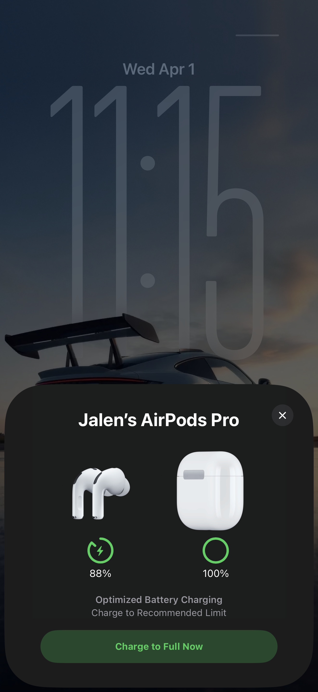

# Journal 1: Apple AirPods

After getting my Apple AirPods, I had just taken them out of the box, and instead of going into my phone’s Bluetooth settings like I normally would with other devices, I just opened the case near my iPhone. Almost instantly, a small animation popped up on my screen showing the AirPods with a “Connect” button. I tapped it, and within a second they were ready to use.

My goal was to connect my AirPods and start listening to music. Normally, this process involves going into settings, turning on Bluetooth, finding the device, and pairing it manually. Because of that, my expectation (or what UX calls a mental model) was that I would have to follow those same steps. However my mental model did not match the conceptual model, in most cases you try to avoid this however in this case I was happy with it. 

What surprised me was how different, and easier, the interaction was. The moment I opened the case, my phone responded automatically. This is a example of affordance, which is how a design suggests what actions are possible. In this case, simply opening the AirPods case initiated the connection process to start. I didn’t need instructions.

Another thing that stood out was the immediate feedback. Feedback means the system clearly shows you what’s happening after you take an action. When I opened the case, the animation appeared right away, and after tapping “Connect,” it showed that the AirPods were successfully paired along with their battery levels. This made the interaction feel smooth and reassuring because I always knew what was going on.

After pairing, using them was just as easy. I was able to go in to the volume slider screen above where I can change the volume, change my listening mode, and even use the conversation awareness feature. Checking the battery was also very easy. I use Apple's battery widget to see the battery of my watch. After pairing, the AirPods and case were displayed immediately.

Overall, the experience was extremely positive. It removed a lot of the friction that usually comes with Bluetooth pairing and made the process feel almost automatic. The system matched what I wanted to do (connect quickly) without forcing me through unnecessary steps.

That said, there is a small downside. Because everything happens so automatically, it can be slightly confusing if something goes wrong. For example, if the AirPods don’t connect right away, it’s not always clear what step failed or how to fix it without going into the more traditional Bluetooth settings. This shows a limitation in visibility, which is how well the system communicates its current state. While the normal case is very smooth, the error case isn’t as clear.

A possible improvement would be to provide a clearer fallback message or quick troubleshooting option directly in the popup when the connection fails. This would keep the same smooth experience while making it easier to recover from errors.

Overall, using AirPods for the first time felt almost effortless. The design takes something that is usually a multi-step process and reduces it to a single, intuitive action. It’s a good example of how thoughtful UX design can make technology feel simple, even when there’s a lot happening behind the scenes.
